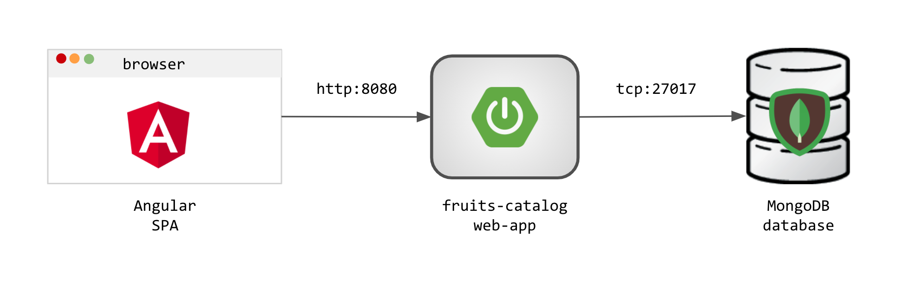
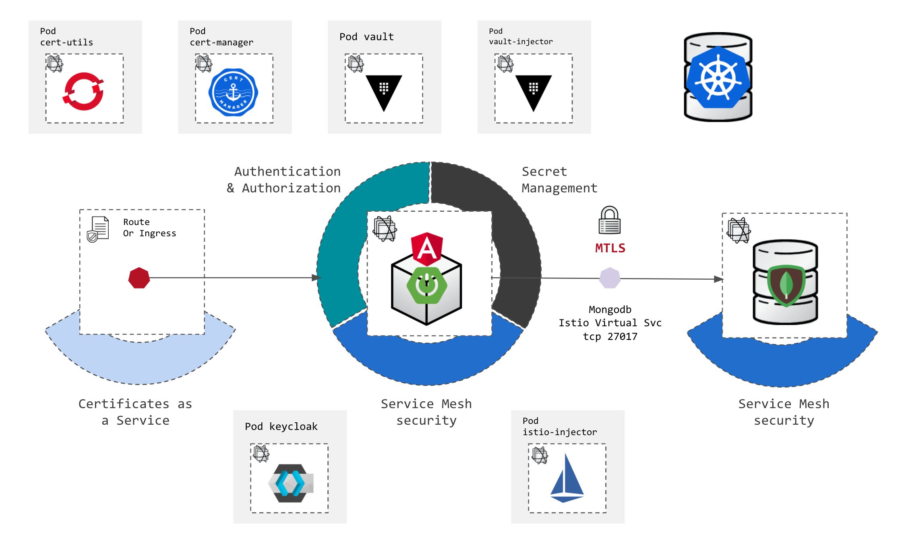

== Introduction 

_2 MINUTE EXERCISE_

In this workshop you will learn how to add different security layers to an existing application using containers, OpenShift/Kubernetes and some other technologies from the Cloud Native Computing Foundation like Keycloak, Vault and Istio.

The overall architecture of the application that you will deploy is quite simple like illustrated below:

.fruits-catalog application architecture

During the different steps of the workshop you will use CodeReady Workspaces, an online IDE is running on Red Hat OpenShift as well as the OpenShift Console to enhance this application from the security point of view.

You will learn how to:

* Deploy this application as **containers** with an **HTTPS** route on OpenShift,
* Build your **PKI as a Service** using HashiCorp Vault and CertManager,
* Add **Authentication & Authorization** to this app using Keycloak,
* Manage and inject **Secrets** in your application with Vault,
* Dynamically generate **database credentials** for your database with Vault,
* Apply a **zero-trust network** policy within your applicatoin using Istio Service Mesh.

The outcome of this workshop is that you'll learn recipes on how transform this app to achieve represents state-of-the-art secured application. We will show you how easy it is to do that using Kubernetes-native patterns and reusing the CNCF eco-system.

.fruits-catalog application enhanced architecture

Don't be afraid by this diagram... we'll go through it step-by-step ;-) You will also have the opportunity to look at some optional steps such as image signing and more to come.

Let's start the workshop with the discovery of OpenShift and CodeReady Workspaces.